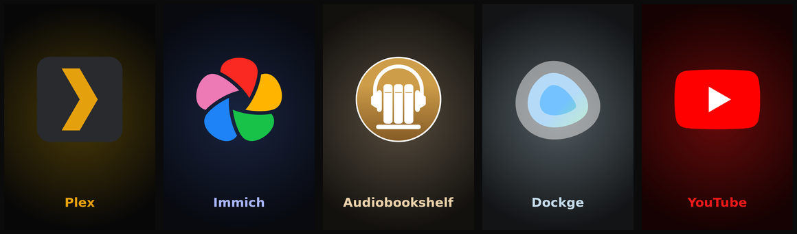

# steam-nonsteam-art

Auto-generate **Steam Big Picture / library artwork** for every *non-Steam*
shortcut — themed from each app's own logo. No SteamGridDB account, no API key,
no GUI. One command and your non-Steam apps look like real games.

It shines for **self-hosted and niche apps** (Immich, Audiobookshelf, Dockge,
Plex, …) that have little or no community art on SteamGridDB.



*Auto-generated capsules — logos pulled by name, colours derived from each logo.*

## Why

Most artwork tools (Steam ROM Manager, BoilR, `steamgrid`, SteamGridDB Boop)
**download** community art from SteamGridDB. That's great for popular games, but
falls apart for the dashboard apps people actually pin to a couch HTPC — there
simply is no community art for "Dockge" or "Audiobookshelf".

`steam-nonsteam-art` takes the opposite approach: it **generates** clean,
visually consistent art from each app's official logo, so every shortcut gets a
full set — even the obscure ones.

## What it generates

For each non-Steam shortcut it writes 5 files into Steam's `grid/` folder, named
by the shortcut's (unsigned) app id:

| File | Size | Role |
|------|------|------|
| `<id>p.png` | 600×900 | portrait capsule (library poster) |
| `<id>.png` | 920×430 | wide capsule (Big Picture rows) |
| `<id>_hero.png` | 1920×620 | hero banner |
| `<id>_logo.png` | 1280×720 | transparent title logo |
| `<id>_icon.png` | 256×256 | icon |

## Requirements

- `bash`, `python3`, `curl`
- **ImageMagick** (`magick` or `convert`)
- A bold TrueType font (DejaVu/Liberation/FreeSans/Arial — autodetected)

Install deps on Debian/Ubuntu:

```bash
sudo apt install imagemagick fonts-dejavu-core python3 curl
```

## Usage

```bash
git clone https://github.com/Wonhochoi123/steam-nonsteam-art.git
cd steam-nonsteam-art
./steam-nonsteam-art.sh
```

That's it — it finds your Steam install(s), reads your non-Steam shortcuts, and
generates art for any that don't have it yet.

```bash
./steam-nonsteam-art.sh            # only fill in shortcuts missing art (idempotent)
./steam-nonsteam-art.sh --force    # regenerate everything
./steam-nonsteam-art.sh --help     # options
```

**Then fully restart Steam** (Steam → Exit, reopen) to load the new artwork.

### Environment overrides

| Var | Purpose |
|-----|---------|
| `FONT=/path/Bold.ttf` | force a specific font |
| `STEAM_ROOT=/path` | target one Steam root (skip autodetect) |
| `GRID=/path` | target one grid dir (handy for dry runs) |
| `ICON_BASE=<url>` | override the icon source |

Dry run into a throwaway folder:

```bash
FORCE=1 GRID=/tmp/test-grid ./steam-nonsteam-art.sh
```

## How it works

1. **Parse** each `shortcuts.vdf` (binary VDF) for `AppName` + `appid`, and
   convert the signed app id to the unsigned value Steam uses for grid filenames
   (`id % 2³²`).
2. **Fetch** a logo by slugified name from the
   [homarr-labs/dashboard-icons](https://github.com/homarr-labs/dashboard-icons)
   repo (thousands of app logos), trying a few name variants.
3. **Theme** from the logo's dominant colour — a darkened glow background and a
   brightened accent for the title text.
4. **Fallback**: apps with no logo get a clean initials tile, coloured from a
   hash of the name.
5. **Generate** all five assets with ImageMagick and drop them in `grid/`.

## Supported Steam installs

Autodetected, including multiple accounts and multiple installs on one machine:

- Native (`~/.steam`, `~/.local/share/Steam`)
- Flatpak (`~/.var/app/com.valvesoftware.Steam/...`)
- Snap (`~/snap/steam/common/...`)
- macOS (`~/Library/Application Support/Steam`)

## Limitations

- It generates **branded template art**, not hand-made fan art. For popular
  games where you want gorgeous community pieces, use SteamGridDB-based tools.
- Multicolour logos can average to a muddy accent colour — override per app by
  dropping your own file into `grid/` with the same name and re-running Steam.
- This tool only handles **artwork**. The Steam overlay can't inject into
  sandboxed (snap/flatpak) apps regardless of art — that's a Steam limitation.

## Comparison

| Tool | Art source | Shortcuts | Headless |
|------|-----------|-----------|----------|
| **steam-nonsteam-art** | **generated from logo** | reads existing | ✅ |
| steamgrid | SteamGridDB | reads existing | ✅ |
| Steam ROM Manager | SteamGridDB | creates | ⚠️ GUI |
| BoilR | SteamGridDB | imports | ⚠️ GUI |
| SteamGridDB Boop | SteamGridDB | manual | ❌ GUI |

Complementary, not competing: use a SteamGridDB tool for AAA games, and this for
your self-hosted dashboard apps.

## Credits

Logos via [homarr-labs/dashboard-icons](https://github.com/homarr-labs/dashboard-icons).

## License

[MIT](LICENSE)
